# PartialFKR User Manual

**Version 0.1 · ideocentric**

---

## Table of Contents

1. [Introduction](#introduction)
2. [Getting Started](#getting-started)
3. [Loading and Saving](#loading-and-saving)
4. [The Partial Canvas](#the-partial-canvas)
5. [Playback](#playback)
6. [Selection](#selection)
7. [Editing](#editing)
8. [Reduction Filters](#reduction-filters)
9. [Gap Operations](#gap-operations)
10. [The Inspector](#the-inspector)
11. [Export](#export)
12. [Keyboard Shortcuts](#keyboard-shortcuts)

---

## 1. Introduction

### 1.1 What is PartialFKR?

PartialFKR is an interactive sinusoidal analysis, editing, and resynthesis application. It analyzes audio files and represents the sound as a set of **partials** — individual frequency tracks that each carry a time-varying frequency and amplitude envelope. You can listen to the resynthesized audio, selectively mute or delete partials, and export the result to drive other instruments and synthesis environments.

PartialFKR is a spiritual successor to Michael Klingbeil's SPEAR. Its analysis engine is based on Loris, an open-source library for sound morphing and transformation.

### 1.2 The re-orchestration workflow

The core workflow is **qualitative partial reduction**:

1. Load an audio file and analyze it.
2. Listen to the resynthesized result — it should closely match the original.
3. Mute or delete partials until the source is no longer recognizable.
4. Export the reduced partial set to drive other instruments.

The aesthetic goal is *re-orchestration*: hearing an implied source signal — its onsets, phonetic gestures, melodic shape — refracted through the timbre of an unrelated instrumental ensemble. Fidelity is not the goal; characteristic preservation through aggressive reduction is.

### 1.3 Supported platforms

- **macOS** (Apple Silicon and Intel) — current release
- **Windows** — coming soon
- **Linux** — coming soon

---

## 2. Getting Started

### 2.1 Installation

**macOS**: Open the `.dmg`, drag PartialFKR to your Applications folder.  
**Windows** and **Linux**: Releases coming soon.

### 2.2 First launch

When PartialFKR first launches, it opens an empty project window ready to receive an audio file for analysis.

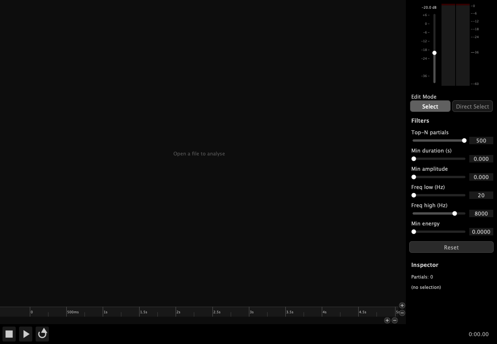

### 2.3 Interface overview

After loading a project or completing an analysis, the interface is divided into three main areas:

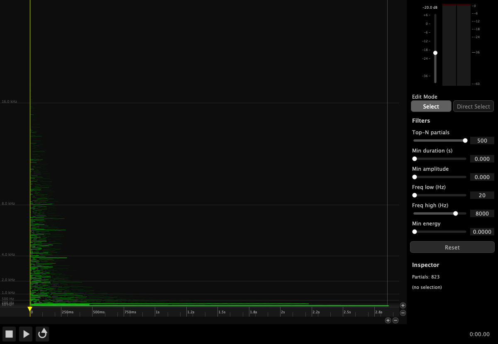

| Area | Description |
|---|---|
| **Partial Canvas** (center) | The main editing area. Partials are displayed as colored lines, with time on the horizontal axis and frequency (Hz) on the vertical axis. Line brightness and weight reflect amplitude. |
| **Transport Bar** (bottom) | Play, Pause, Stop, and Loop buttons; time display; In and Out markers. |
| **Right Panel** (right edge) | Output gain fader, stereo level meter, Edit Mode buttons, Reduction Filters, and the Inspector. Can be hidden with ⌘⌥S. |

The following annotated images label each area and control:

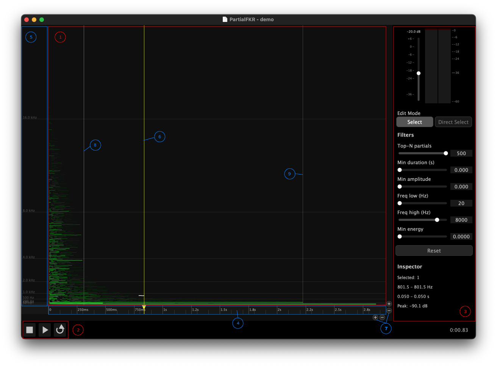

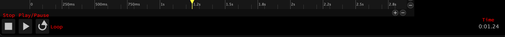

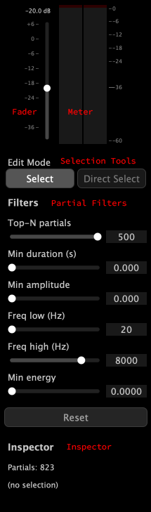

---

## 3. Loading and Saving

### 3.1 Analyzing an audio file

**File → Analyze Audio…** opens a file picker. Select a WAV or AIFF file. PartialFKR will analyze it using sinusoidal modeling and populate the canvas with the resulting partials. Analysis time depends on file length; a progress indicator is shown.

Once analysis is complete, the window title updates to show the source filename and the proxy icon is set to the audio file.

> **Note:** A project can only hold one analyzed audio file. Once analysis is complete, the Analyze Audio menu item is disabled for that window. Open a new window (⌘N) to analyze a second file.

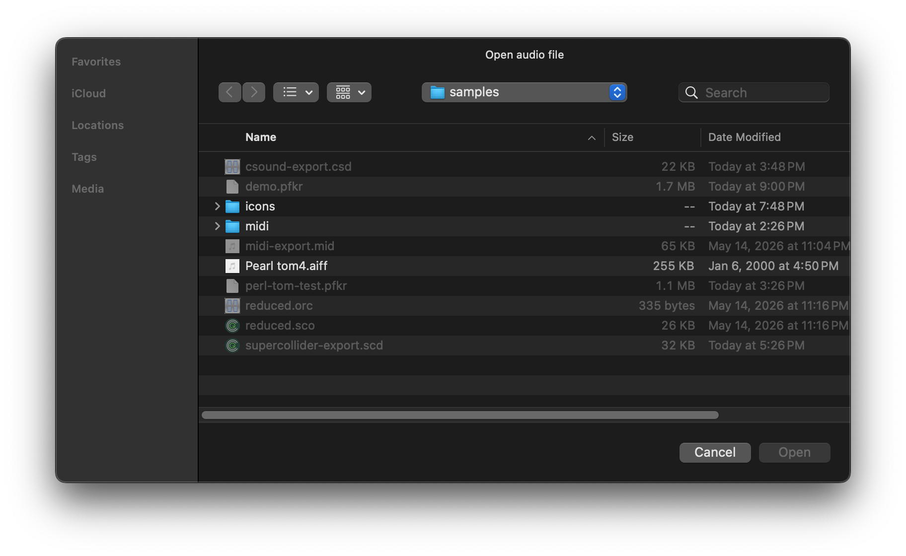

### 3.2 Opening a project (.pfkr)

**File → Open…** (⌘O) opens a `.pfkr` project file. A `.pfkr` file stores the complete partial set, reduction filter settings, zoom state, and other view parameters. It does not store the original audio.

On macOS, you can also double-click a `.pfkr` file in Finder, or drag it onto the PartialFKR dock icon.

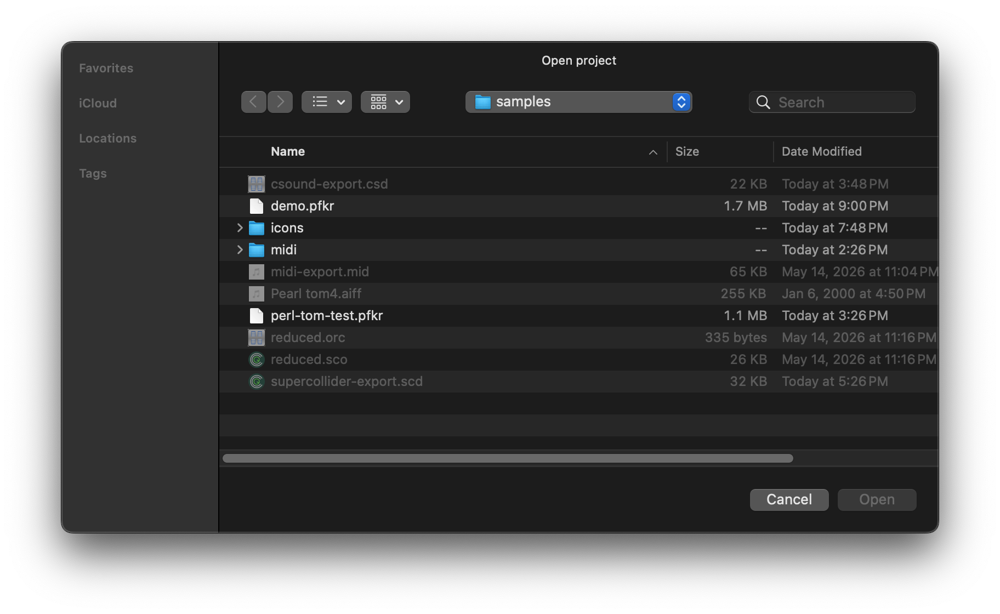

**Opening into a specific window:** If the frontmost window has no partials loaded, the file is opened into that window. If the window already has content, a new window is created.

### 3.3 Opening from Finder

After the application has been run at least once, `.pfkr` files will show "Open with PartialFKR" in Finder's context menu. Double-clicking a `.pfkr` file opens it directly in PartialFKR.

### 3.4 Save and Save As

| Command | Key | Behavior |
|---|---|---|
| Save | ⌘S | Saves to the current `.pfkr` file. If the project has never been saved, falls through to Save As. |
| Save As… | ⌘⇧S | Prompts for a new filename and saves. |

After a successful save, the window title updates to the project filename and the macOS proxy icon points to the `.pfkr` file.

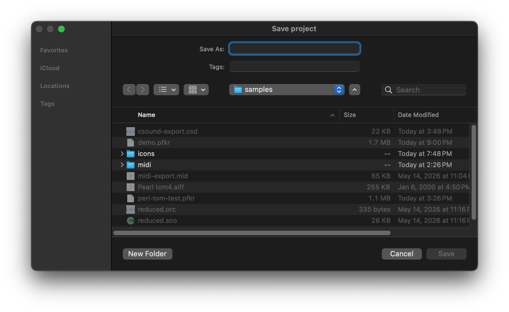

### 3.5 Unsaved changes

If you close a window or quit the application with unsaved changes, a dialog appears:

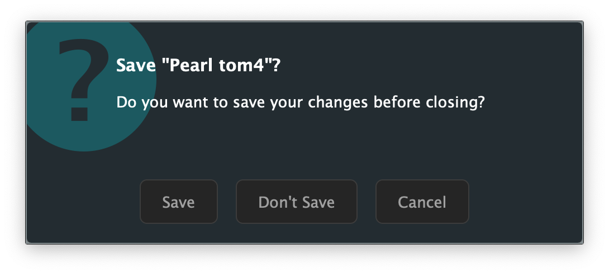

- **Save** — saves the project, then closes.
- **Don't Save** — discards changes and closes.
- **Cancel** — returns to the application without closing.

When quitting with multiple dirty windows open, each window is handled in sequence. Cancelling any one of them aborts the quit.

---

## 4. The Partial Canvas

### 4.1 Reading the display

The canvas plots partials as colored lines:

- **Horizontal axis**: Time (seconds)
- **Vertical axis**: Frequency (Hz), with lower frequencies at the bottom
- **Color**: All partials are drawn in green
- **Brightness and line weight**: Both increase with amplitude — louder partials appear brighter and thicker

### 4.2 Navigating: zoom and pan

**Zoom (time axis)**

| Action | Effect |
|---|---|
| ⌘= | Zoom in (expand time axis) |
| ⌘− | Zoom out (compress time axis) |
| ⌘0 | Zoom to fit — shows all partials |
| ⌘+scroll | Zoom in/out at cursor position |

The zoom buttons in the top-right of the canvas (+ and −) perform the same zoom operations.

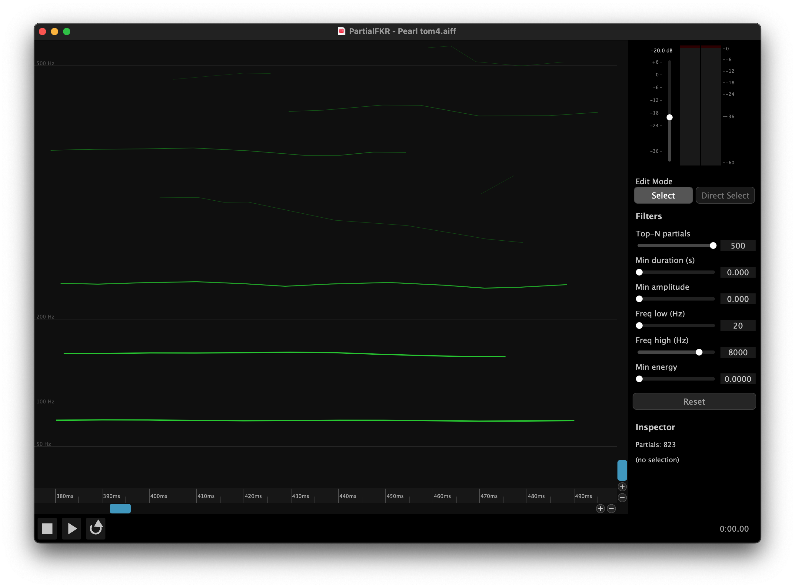

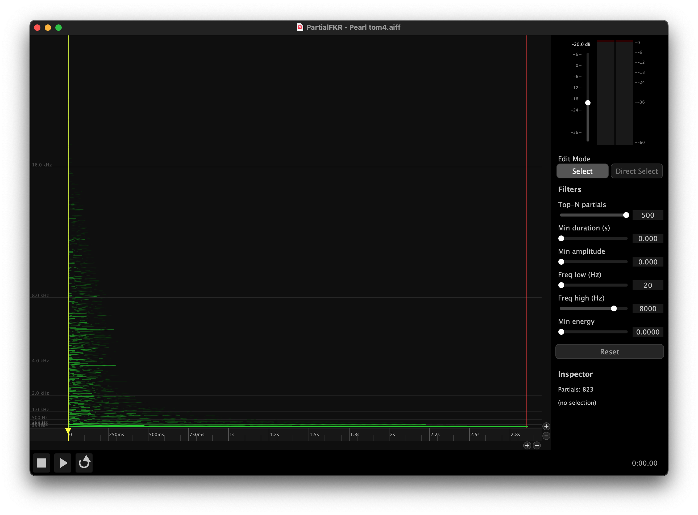

**Pan**

| Action | Effect |
|---|---|
| Scroll wheel / trackpad | Pan frequency (vertical) |
| ⌥+scroll | Zoom frequency axis |
| Arrow keys | Pan time (← →) or frequency (↑ ↓) |
| Drag empty canvas area | Pan time and frequency |

### 4.3 The playhead

The yellow vertical line indicates the current playback position. Click anywhere on the ruler (the time strip at the top of the canvas) to reposition the playhead. Dragging the playhead handle scrubs audio.

---

## 5. Playback

### 5.1 Play, Pause, Stop

| Button | Key | Action |
|---|---|---|
| ▶ Play | Space | Start playback from the current playhead position |
| ⏸ Pause | Space | Pause playback (retains position) |
| ⏹ Stop | — | Stop playback and return to the in-point |

Playback can also be started by pressing **Space** anywhere in the canvas.

### 5.2 Loop mode

Click the **Loop** button (or use **Transport → Loop**) to enable looped playback. When loop is on, playback restarts at the beginning automatically.

### 5.3 Scrubbing

Hold **Option (⌥)** and drag the playhead to scrub through the audio. The canvas and synth follow the drag position in real time. When you release, playback resumes from the scrub position.

### 5.4 In and Out markers

The **In marker** and **Out marker** define the active play region on the canvas ruler. Drag them to set the range; playback starts from the In point and stops (or loops) at the Out point. Use **Transport → Stop** to return to the In point.

### 5.5 Output gain and level meter

The **output gain fader** and **stereo level meter** are at the top of the right panel. The fader controls master output gain (−40 to +6 dB, default −20 dB). The meter shows peak output with hold indicators and clip lights.

Click the clip lights to reset them after a peak-clipping event.

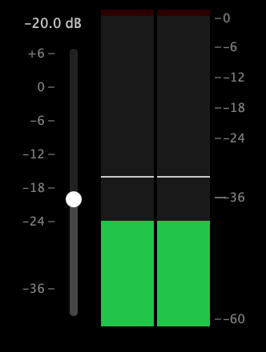

### 5.5 Selection-based solo

When partials are selected, only the selected partials are audible during playback. This makes it easy to isolate specific partials and assess their contribution. Deselect all partials to hear the full (unfiltered) resynthesis.

---

## 6. Selection

PartialFKR has two selection modes, chosen with keyboard shortcuts or the **Edit Mode** buttons in the right panel.

### 6.1 Select mode (V key)

Select mode operates on **whole partials**.

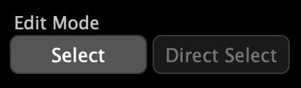

| Action | Result |
|---|---|
| Click a partial | Select it (deselects others) |
| ⌘+click | Add/remove from current selection |
| Drag from empty area | Rubber-band: select all partials whose time range intersects the rectangle |
| ⌘+drag | Add/remove from selection by rectangle |
| Click empty area | Deselect all |

Selected partials are highlighted with a yellow tint.

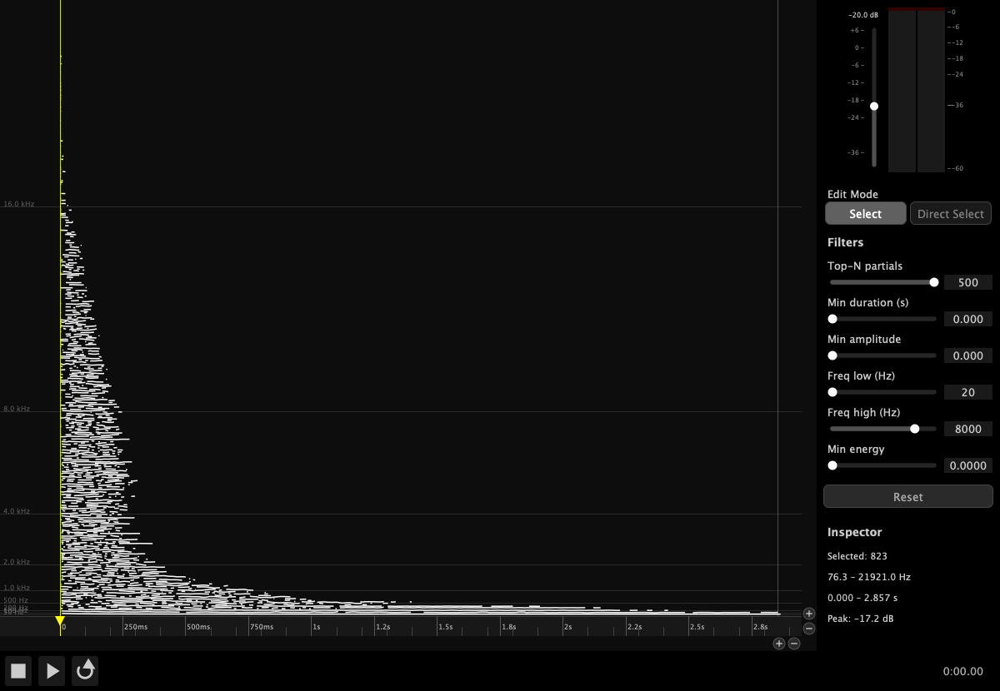

### 6.2 Direct Select mode (A key)

Direct Select mode operates on **individual breakpoints** — the control points that define a partial's trajectory.

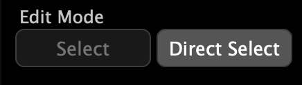

| Action | Result |
|---|---|
| Click a breakpoint | Select it |
| ⌘+click | Add/remove a breakpoint from selection |
| Drag from empty area | Rubber-band: select all breakpoints in the rectangle |
| Drag a selected breakpoint | Move it to a new time/frequency position |

Breakpoints are displayed as small dots on each partial. Selected breakpoints are highlighted.

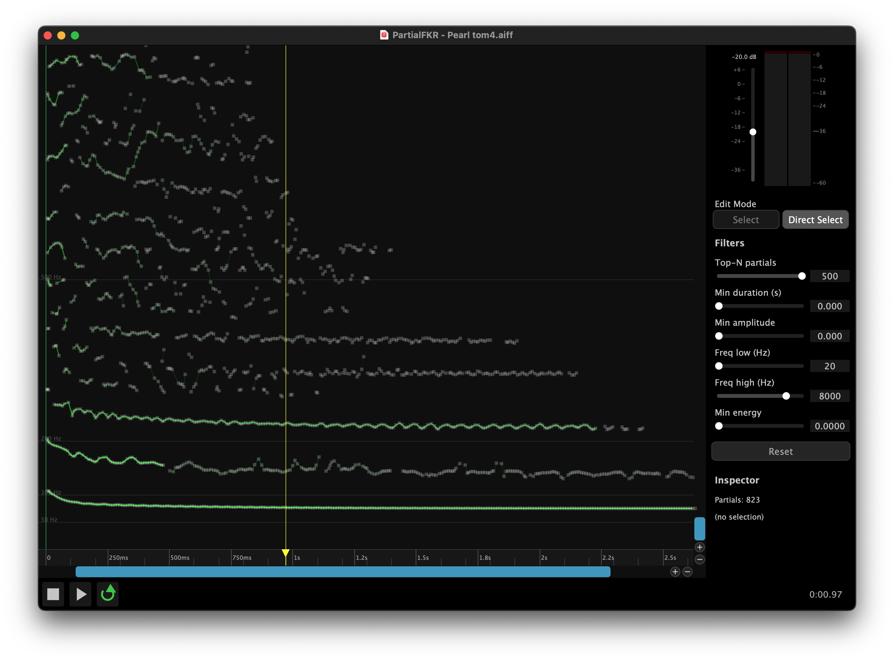

### 6.3 Select All, Deselect All, Invert Selection

These commands operate in the current mode (whole partials or breakpoints):

| Command | Key |
|---|---|
| Select All | ⌘A |
| Deselect All | ⌘⇧A |
| Invert Selection | ⌘⇧I |

---

## 7. Editing

All editing operations are undoable. Use ⌘Z to undo and ⌘⇧Z to redo.

### 7.1 Copy, Cut, Paste

| Command | Key | Notes |
|---|---|---|
| Copy | ⌘C | Copies selected partials (with full breakpoint data and color) to the clipboard |
| Cut | ⌘X | Copies then deletes |
| Paste | ⌘V | Pastes at the position last clicked in the canvas background |

**Cross-window paste**: The clipboard is shared across all open windows. Copy in one window and paste into another. To set the paste position in the destination window, click the canvas background before pasting.

### 7.2 Delete

Press **Delete** or **Backspace** to delete:
- In Select mode: removes the selected partials entirely
- In Direct Select mode: removes the selected breakpoints from their partials

Deletion is undoable.

### 7.3 Undo and Redo

PartialFKR maintains a full undo history for all structural edits (delete, paste, stretch, normalize, bridge, crossfade). Use ⌘Z / ⌘⇧Z, or the Edit menu.

The Edit menu shows a description of the next undo/redo operation (e.g., "Undo Delete").

### 7.4 Stretch / Compress

Press **T** (or **Edit → Stretch / Compress…**) to time-scale the selected partials or breakpoints.

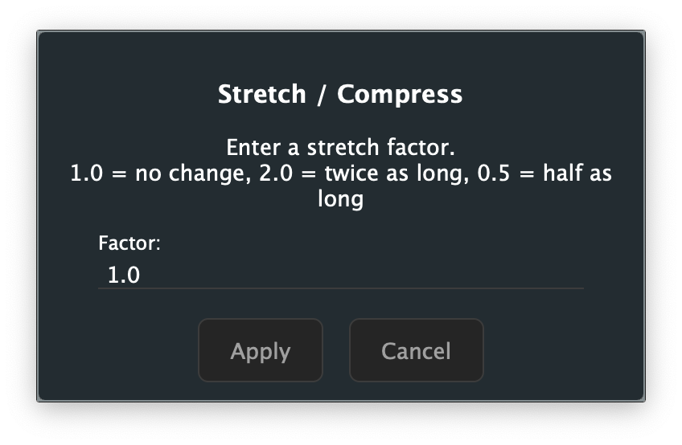

Enter a factor:
- **1.0** — no change
- **2.0** — twice as long (slowed down)
- **0.5** — half as long (sped up)

The operation anchors to the earliest start time in the selection. Stretch is undoable.

### 7.5 Normalize

**Edit → Normalize** scales all unmuted partials so the loudest peak in the resynthesized output reaches 0 dBFS. This is useful after heavy reduction, when the remaining partials may be much quieter than the original.

Normalize is undoable and runs asynchronously — a brief pause may occur on large partial sets.

### 7.6 Scale Amplitude

**Edit → Scale Amplitude…** opens a dialog to multiply all unmuted partial amplitudes by a specific factor.

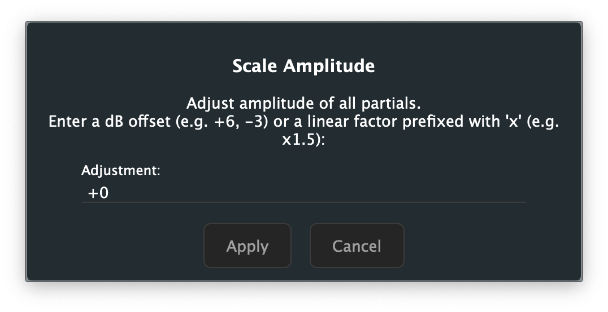

Enter the scale factor in dB or as a linear value. Positive dB values increase amplitude; negative values decrease it. Scale Amplitude is undoable.

---

## 8. Reduction Filters

The **Filters** section of the right panel contains six sliders that instantly hide partials meeting threshold criteria. Filtered partials are muted in real time; you can hear the effect immediately during playback.

Filtering is non-destructive: partials are hidden, not deleted. Use **Reset** to restore all partials.

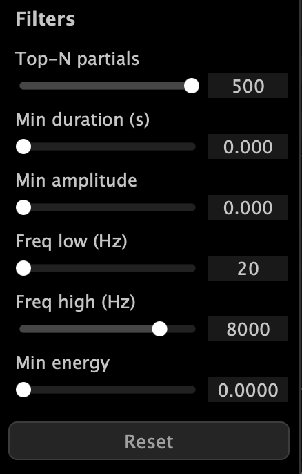

### 8.1 Workflow

The typical reduction workflow:

1. Play the full resynthesis to establish a reference.
2. Adjust a filter slider (e.g., Top-N) while playing to hear the effect in real time.
3. When satisfied with a setting, move to the next filter.
4. Export when the desired reduction level is reached.

### 8.2 Top-N partials

Retains only the **N loudest partials** (by peak amplitude). All other partials are muted.

- Range: 1–500
- Default: 500 (effectively no filtering)
- Use this as the primary broadness control — start by setting it low (e.g., 10–30) and work up until you have the desired density.

### 8.3 Minimum duration

Hides partials shorter than the threshold duration.

- Range: 0–250 ms
- Default: 0 (no filtering)
- Useful for removing very short transient artifacts from the analysis.

### 8.4 Minimum amplitude

Hides partials whose **peak amplitude** falls below the linear threshold.

- Range: 0.0–1.0 (linear)
- Default: 0.0 (no filtering)

### 8.5 Frequency band (low / high)

- **Freq low**: hides partials whose frequency is below the threshold (removes bass content)
- **Freq high**: hides partials whose frequency is above the threshold (removes treble content)
- Range: 20–20,000 Hz (logarithmic scale)
- Defaults: 20 Hz (low), 8000 Hz (high)

Use these together to isolate a specific frequency range. For example, set Freq low to 200 Hz and Freq high to 4000 Hz to hear only midrange partials.

### 8.6 Minimum energy

Hides partials with very little total energy (amplitude × duration).

- Range: 0.0–0.1
- Default: 0.0 (no filtering)
- Energy is computed as ∑(average amplitude × Δt) in linear·seconds.
- This filter is more musically useful than Min Amplitude for removing low-level sustained partials.

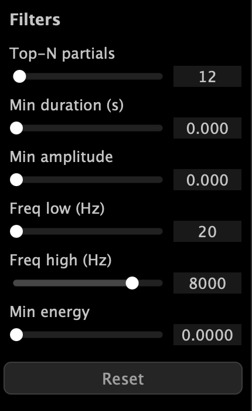

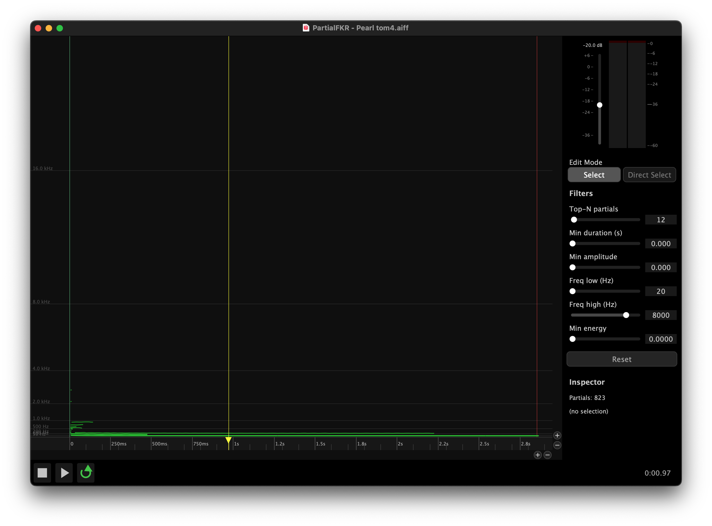

### 8.7 Reset

The **Reset** button clears all six filter sliders to their defaults, restoring all muted partials to audibility.

---

## 9. Gap Operations

Gap operations combine two separate partial fragments into a single continuous partial. Both operations are undoable.

### 9.1 Bridge Partials (⌘J)

Bridges the **gap** between two partial fragments that should be continuous but were separated because the amplitude dropped below the analysis threshold.

**Triggering in Select mode**: Select exactly two partials where one ends before the other begins (a gap exists between them). Press ⌘J.

**Triggering in Direct Select mode**: Select one breakpoint from each of two different partials. Press ⌘J.

**What it does**: Linearly interpolates frequency and amplitude at 5 ms intervals across the gap, producing a smooth connection between the two fragments. The two originals are replaced by a single merged partial.

> **Tip:** If ⌘J is greyed out, check that exactly two partials are selected, that they do not overlap in time, and that one ends before the other begins.

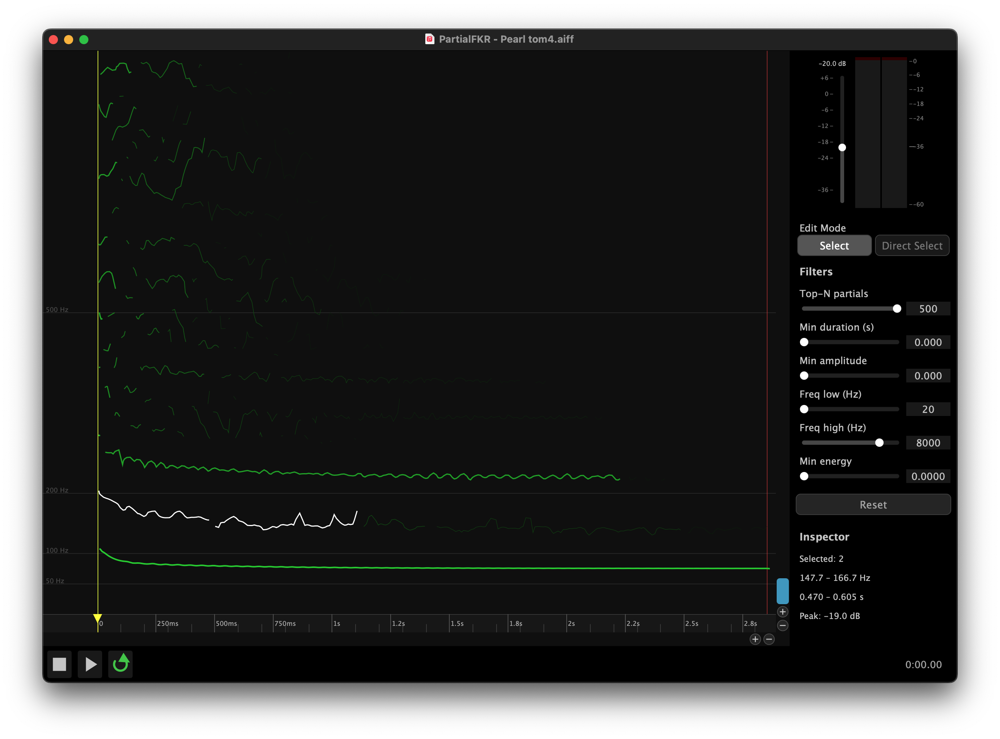

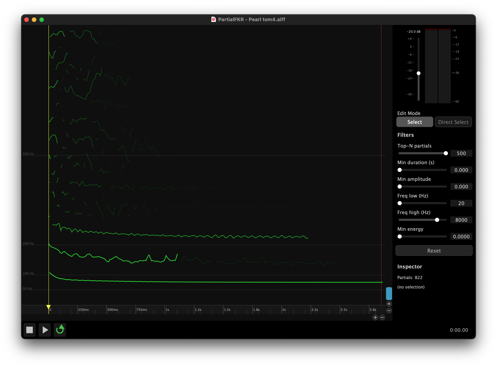

### 9.2 Crossfade Overlap (⌘⇧J)

Blends two overlapping partials into a single continuous partial by **crossfading** the overlap region.

**Triggering**: Same as Bridge Partials, but the two selected partials must overlap in time (the first has not ended when the second begins).

**What it does**: In the overlap region, amplitude is weighted so that the first partial fades out while the second fades in. Frequency is interpolated throughout. The result is a single merged partial with no abrupt transitions.

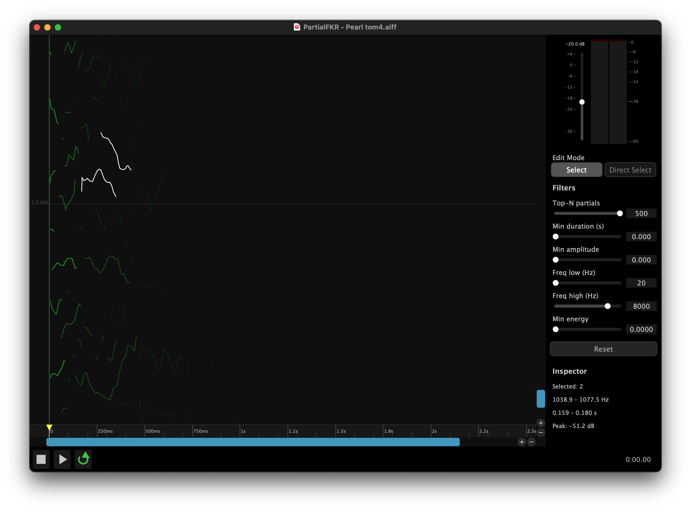

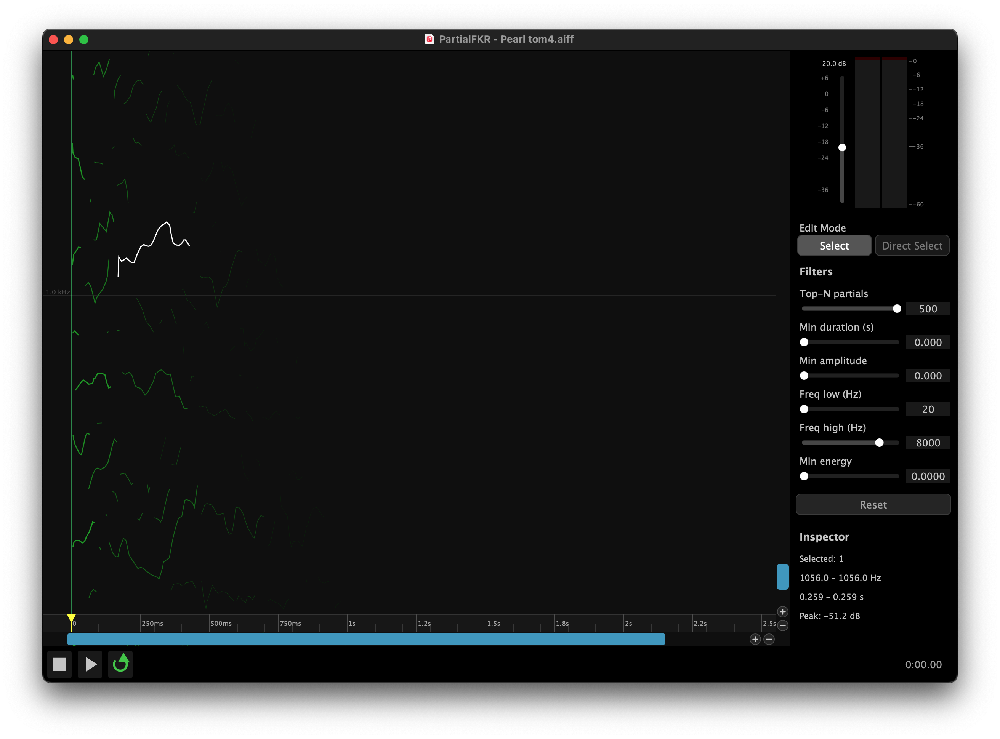

---

## 10. The Inspector

The Inspector panel shows summary statistics about the current selection.

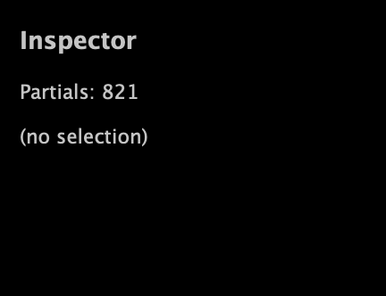

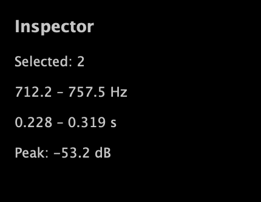

| Field | Description |
|---|---|
| **Partials** | Number of selected partials (or total if nothing is selected) |
| **Frequency range** | Lowest and highest fundamental frequency across the selection |
| **Duration** | Time span from earliest onset to latest offset |
| **Peak amplitude** | Maximum amplitude value across the selection |

The Inspector updates immediately as the selection changes.

---

## 11. Export

All export formats operate on the **unmuted** partials only. Muted or filtered partials are excluded.

Access all export options via **File → Export**.

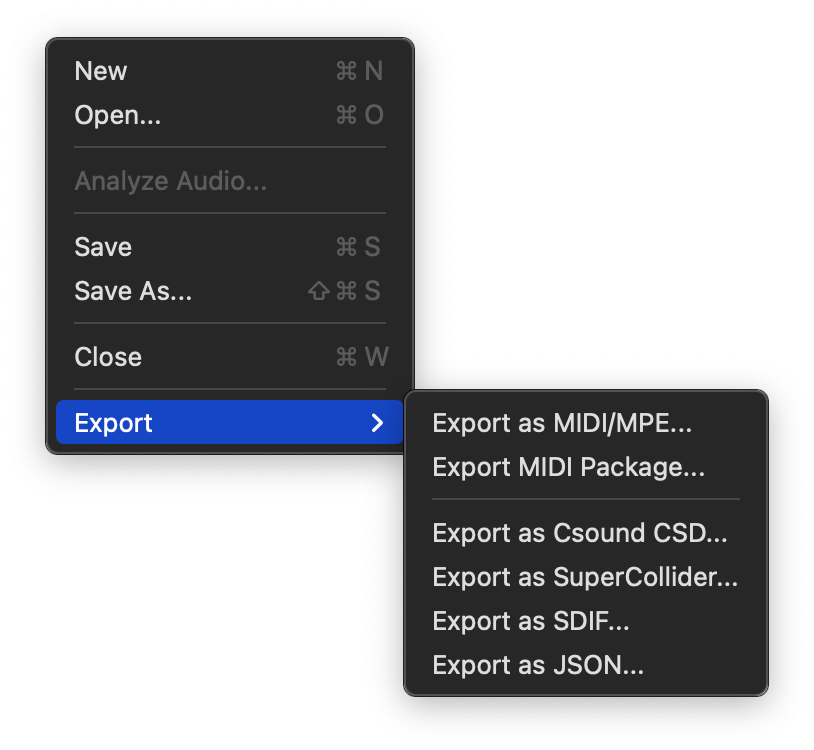

### 11.1 Export as MIDI/MPE

Exports all partials as a single **MPE** (MIDI Polyphonic Expression) MIDI file, with one note per partial.

Each partial becomes a note with:
- **Pitch bend** updated frame-by-frame to track the partial's frequency
- **CC11 (Expression)** updated frame-by-frame to track amplitude
- **Note-on velocity** derived from the initial amplitude

Before the file is saved, a dialog asks you to choose a **pitch bend range** (±2, ±12, ±24, or ±48 semitones). The dialog shows the percentage of partials that fit within each range, helping you choose the minimum range that covers your material without sacrificing resolution.

> **Tip:** Use ±12 semitones for lightly pitched material; ±48 for highly chromatic or atonal content.

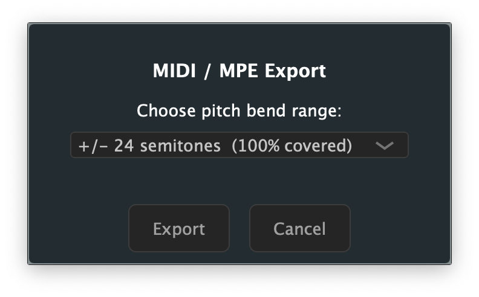

### 11.2 Export MIDI Package

Exports **one MIDI file per partial**, plus a Bill of Materials (BOM) CSV and a readme, all into a folder you choose.

The BOM CSV contains one row per partial with columns: filename, start time, end time, duration, frequency range, amplitude range (dB), peak velocity, bend range used, maximum pitch deviation (cents), and total energy. This data is useful for routing partials to specific instruments or voices in a DAW.

Files are named `partial_001.mid`, `partial_002.mid`, etc. (zero-padded).

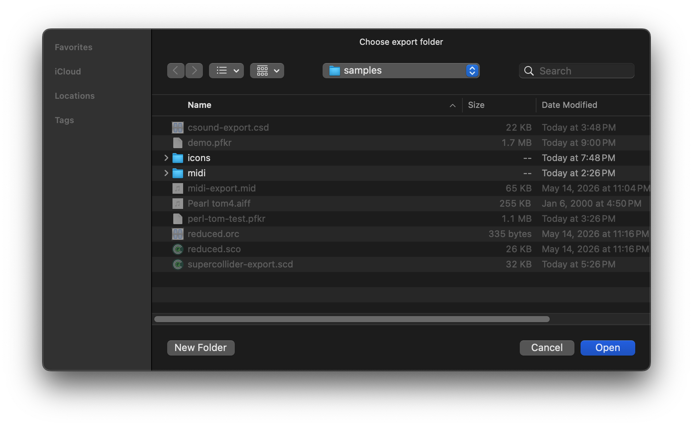

### 11.3 Export as Csound CSD

Exports a self-contained **Csound CSD** file that exactly reproduces the resynthesis when run with Csound.

The generated file uses one pair of GEN07 function tables per partial (frequency envelope + amplitude envelope), read with a `BufRd`-equivalent instrument. Tempo and sample rate match PartialFKR's settings (default 48 kHz, 5 ms control period).

**To use**: Open the `.csd` in the Csound IDE or run from the terminal: `csound output.csd`

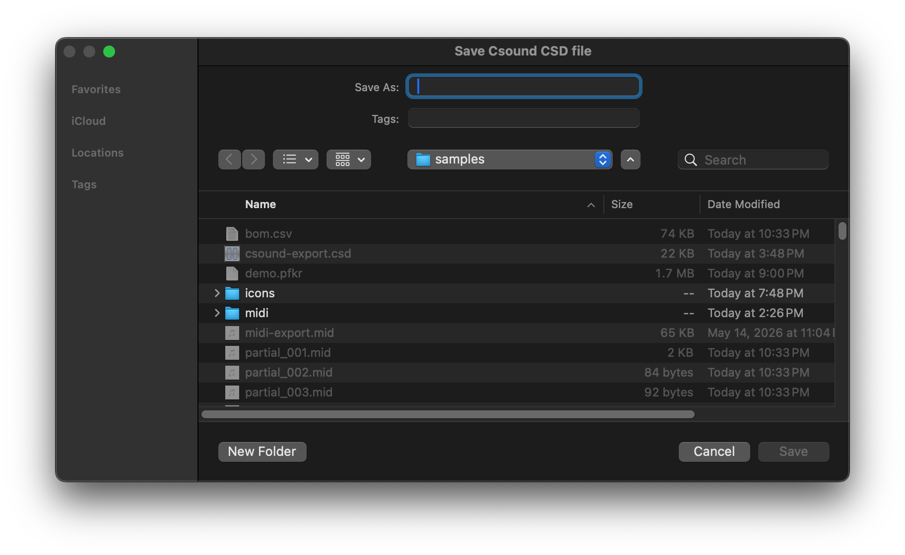

### 11.4 Export as SuperCollider

Exports a self-contained **SuperCollider `.scd`** file. Open it in the SuperCollider IDE and evaluate the outer block (⌘Return on macOS) to boot the server, load buffers, and play back the resynthesis.

The script uses `Env.asSignal` to discretize each partial's breakpoint envelope into a server buffer at 5 ms resolution, then schedules one `Synth` per partial at its analysis onset time.

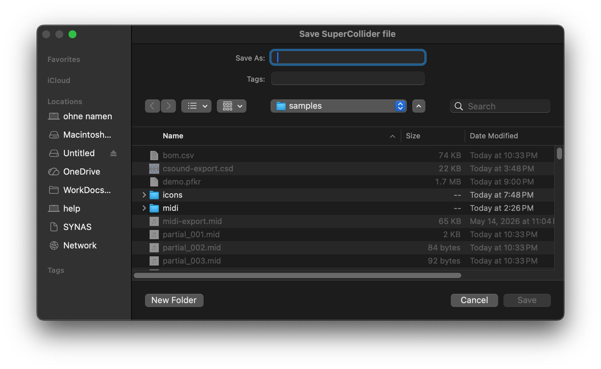

### 11.5 Export as SDIF

Exports partials in the **SDIF** (Sound Description Interchange Format), compatible with Loris, SPEAR, and other analysis tools.

A dialog lets you choose the frame type:
- **1TRC** — standard sinusoidal tracks (compatible with most tools)
- **RBEP** — Loris bandwidth-enhanced partial format (preserves noise residual data)

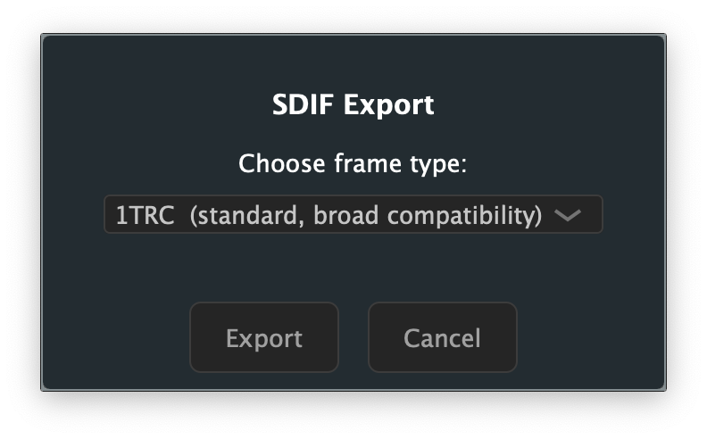

### 11.6 Export as JSON

Exports partials as a JSON file, useful for data interchange with custom tools or scripts.

Each partial is represented as an object with metadata (id, start time, duration, color) and an array of breakpoints (time, frequency, amplitude, bandwidth, phase).

---

## 12. Keyboard Shortcuts

### File

| Action | Shortcut |
|---|---|
| New window | ⌘N |
| Open project | ⌘O |
| Save | ⌘S |
| Save As | ⌘⇧S |
| Close window | ⌘W |

### Edit

| Action | Shortcut |
|---|---|
| Undo | ⌘Z |
| Redo | ⌘⇧Z |
| Cut | ⌘X |
| Copy | ⌘C |
| Paste | ⌘V |
| Delete | Delete or Backspace |
| Select All | ⌘A |
| Deselect All | ⌘⇧A |
| Invert Selection | ⌘⇧I |
| Bridge Partials | ⌘J |
| Crossfade Overlap | ⌘⇧J |
| Stretch / Compress… | T |

### View

| Action | Shortcut |
|---|---|
| Zoom In | ⌘= |
| Zoom Out | ⌘− |
| Zoom to Fit | ⌘0 |
| Show/Hide Panel | ⌘⌥S |

### Transport

| Action | Shortcut |
|---|---|
| Play / Pause | Space |
| Loop toggle | (Transport menu) |
| Minimize window | ⌘M |

### Tools

| Action | Key |
|---|---|
| Switch to Select mode | V |
| Switch to Direct Select mode | A |

### Navigation (canvas focused)

| Action | Key |
|---|---|
| Pan left / right | ← / → |
| Pan up / down (frequency) | ↑ / ↓ |
| Zoom time in/out | ⌘+scroll |
| Zoom frequency in/out | ⌥+scroll |

---

*PartialFKR is open-source software distributed under the AGPLv3 license.*  
*Source code and issue tracker: [github.com/ideocentric/partialfkr](https://github.com/ideocentric/partialfkr)*